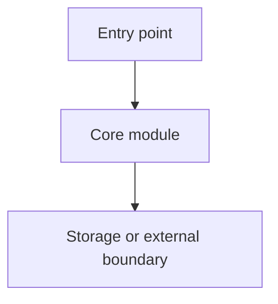
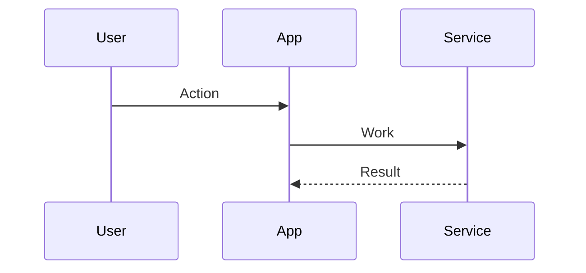

# Code Read

Analyze a repository and produce a grounded Markdown report for understanding it. Favor evidence from files over assumptions, and do not change product code while reading.

## Workflow

1. Scope the read:
   - Clarify the target area only if the user request is too broad to produce a useful report.
   - Otherwise inspect the whole repository at a practical level, then go deeper on entry points, core modules, configs, and tests.
2. Discover structure:
   - Use `rg --files` first.
   - Read `README*`, `AGENTS.md`, contribution docs, package manifests, build configs, test configs, CI workflows, and obvious entry points.
   - Identify generated, vendored, build output, dependency, or cache directories and avoid treating them as source.
3. Trace behavior:
   - Follow main entry points through important modules.
   - Read representative tests to understand expected behavior.
   - Use targeted searches for exported APIs, route handlers, command definitions, schemas, and configuration.
4. Write the report in Markdown:
   - Include Mermaid diagrams where they clarify architecture, module relationships, data flow, request flow, state transitions, or build/test flow.
   - Include short code snippets for key patterns, APIs, data models, or algorithms.
   - Add clickable code reference links whenever possible. Prefer links in this form: `[path/to/file.ext](/absolute/path/to/file.ext:line)`.
   - Cite specific files and line numbers for claims about behavior.
5. Validate the report:
   - Re-check referenced paths and line numbers.
   - Mark uncertainty clearly when behavior is inferred rather than directly shown in code.
   - Keep the report useful for onboarding: concise enough to scan, detailed enough to act on.

## Report Format

Use this structure unless the user asks for a different report shape:

````markdown
# Repository Understanding Report

## Executive Summary

## Repository Map



## Key Directories and Files

| Path | Purpose |
| --- | --- |
| [src/main.ts](/abs/path/src/main.ts:1) | Main entry point |

## Runtime or Request Flow



## Core Concepts

## Important Code Snippets

```ts
// Short snippet that illustrates the pattern.
```

Source: [src/example.ts](/abs/path/src/example.ts:12)

## Build, Test, and Tooling

## Risks, Gotchas, and Open Questions

## Suggested Next Reads
````

## Code References

- Prefer absolute clickable file links with a line number.
- Use `nl -ba <file>` or editor-aware reads when exact line numbers matter.
- Keep snippets short. Show only the lines needed to support the explanation.
- If a code block comes from a file, place the source link immediately before or after it.
- Do not fabricate links for files that do not exist.

## Guardrails

- Do not edit source files unless the user explicitly asks for documentation to be saved into the repository.
- Do not run tests or build commands unless they help confirm understanding and are safe for the repository.
- Do not present generated, vendored, or dependency code as first-party architecture.
- Do not overstate certainty. Label inferred behavior as inference.
- Do not include secrets or sensitive values from local config in the report.
