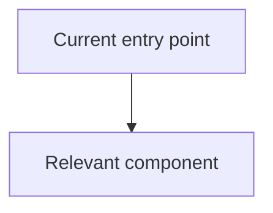
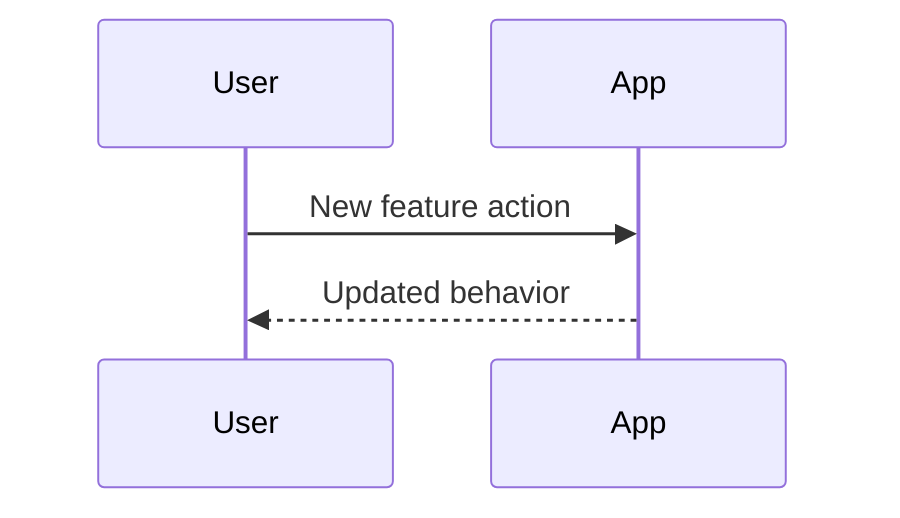

# Implement

Turn a feature idea into working code through a proposal-first workflow. Do not make implementation edits until the user approves the proposal.

## Workflow

1. Understand the request and inspect the codebase:
   - Read relevant `README*`, `AGENTS.md`, package manifests, tests, and nearby code.
   - Use `rg --files` and targeted searches to find the affected modules.
   - Identify the project's primary programming language or the language of the affected area from manifests, file extensions, and nearby code.
   - Ask only for missing information that blocks a coherent proposal.
2. Present and save an implementation proposal in Markdown:
   - Include the problem statement, goals, non-goals, affected files, data or control flow, implementation steps, risks, and validation plan.
   - Include at least one Mermaid diagram when it clarifies architecture, flow, state, sequence, or dependencies.
   - Include short code snippets or pseudocode for the key API, data model, interface, or algorithm.
   - Use the project's primary programming language for code snippets by default. If the proposal targets a specific subsystem, use that subsystem's language. Use pseudocode only when no project language is clear.
   - Use Markdown tables when they make tradeoffs, affected files, data shapes, validation plans, or rollout steps easier to compare.
   - Keep snippets illustrative; do not pretend they are final diffs.
   - Save the proposal to a local file under the current working directory by default, using a clear filename such as `implementation-proposal-<feature>.md`.
   - Treat the keyword `pwd` as an explicit request to save under the current working directory.
   - Treat the keyword `tmp` as an explicit request to save under a temporary directory, using `$TMPDIR/implementation-proposal-<feature>.md` when `$TMPDIR` is available or `/tmp/implementation-proposal-<feature>.md` otherwise.
   - If the user specifies an output path, save the proposal there instead of using `pwd` or `tmp`.
   - Tell the user the saved proposal path and wait for feedback or approval before implementing.
3. Refine with user feedback:
   - Incorporate requested changes into a revised proposal.
   - Resolve tradeoffs explicitly when feedback changes scope, risk, migration strategy, or compatibility.
   - Continue revising until the user approves implementation.
4. Implement only after explicit approval:
   - Treat words such as "approved", "go ahead", "implement it", "ship it", or equivalent clear confirmation as approval.
   - If approval is ambiguous, ask before editing files.
   - Keep changes scoped to the approved proposal unless a discovered blocker requires a small adjustment.
   - If implementation must materially diverge from the approved proposal, stop and get approval for the revised approach.
5. Validate and report:
   - Run the most relevant tests, linters, type checks, or focused commands supported by the project.
   - Update docs or examples when the implemented behavior changes user-facing usage.
   - Summarize what changed, validation results, and any remaining risks.

## Proposal Format

Use this shape unless the project calls for a different one:

````markdown
## Implementation Proposal

### Summary

### Goals

| Goal | Why It Matters |
| --- | --- |
| Add the new behavior | User-visible outcome |

### Non-Goals

| Non-Goal | Reason |
| --- | --- |
| Rewrite unrelated modules | Keep scope controlled |

### Current Flow



### Proposed Flow



### Key Changes

| Area | Change | Files |
| --- | --- | --- |
| API | Add the new handler path | `src/example` |

### Code Sketch

```<project-language>
// Use the language of the current project or affected subsystem.
function example() {
  return "sketch";
}
```

### Validation Plan

| Check | Command or Method | Expected Result |
| --- | --- | --- |
| Focused test | `<project test command>` | New behavior passes |

### Risks and Tradeoffs

| Risk | Mitigation |
| --- | --- |
| Compatibility issue | Keep behavior behind the approved boundary |
````

## Guardrails

- Do not edit source files during the proposal phase.
- Saving the proposal Markdown file is allowed during the proposal phase; product/source implementation edits are not.
- Do not skip the proposal just because the implementation looks straightforward.
- Do not run broad, expensive, or destructive commands as part of discovery.
- Do not over-specify low-level details before reading the relevant code.
- Prefer the repository's existing patterns over new abstractions.
- Keep the final implementation traceable to the approved proposal.
